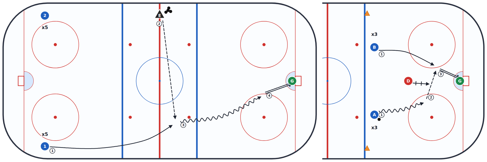
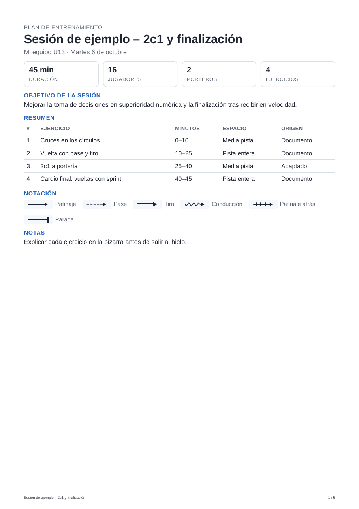
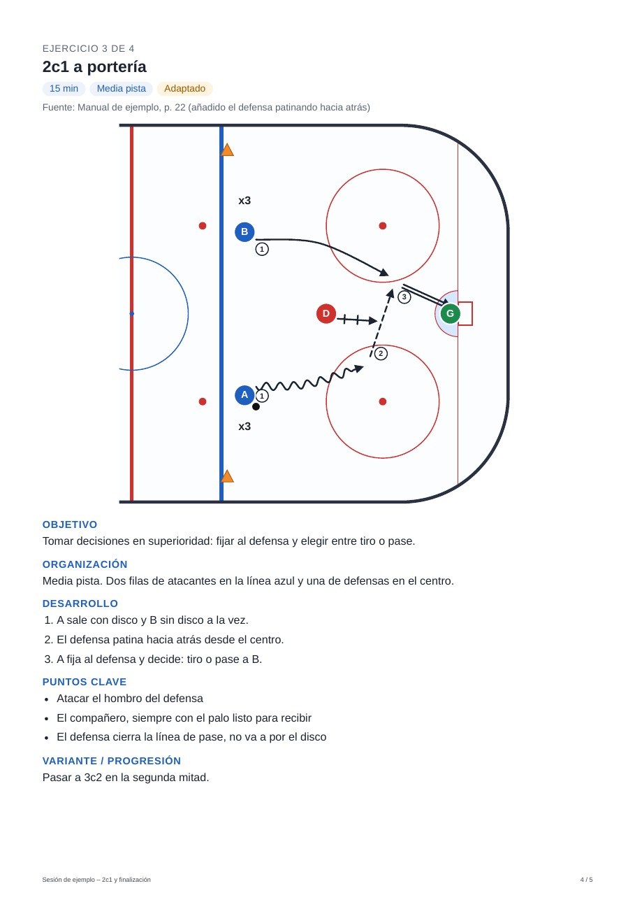
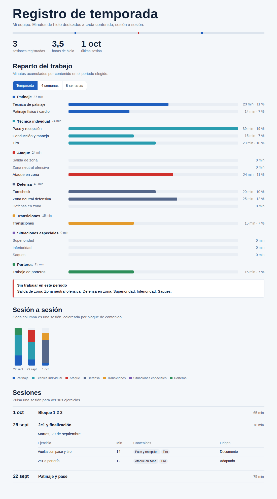
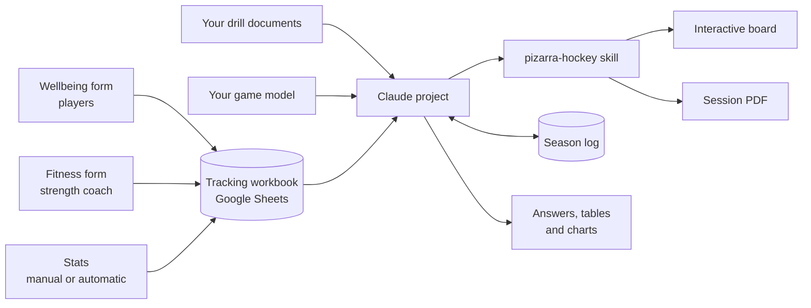

# 🏒 Hockey Coach Assistant

[Español](README.md) · **English**

**Version 1.0 · October 2026** · [What's new](CHANGELOG.md)

> **Before you start:** this kit runs inside **Claude**, so you need a Claude account. You can try it on the free plan, but for real use **Claude Pro** is recommended (more details in [Requirements](#requirements)).
>
> **This is the first version.** It works and is used daily with a real team, but it will keep improving: see the [Next steps](#next-steps) and the [changelog](CHANGELOG.md).
>
> **Language note:** the templates, the drill board and the session PDF are in Spanish. You can ask Claude to translate the templates before you use them (see [Installation](#installation)).

**An ice hockey coaching assistant built on Claude.** It plans practices from your own drills and your game model, draws them on an interactive board, generates a PDF for each session, logs what you have worked on across the season, and tracks your players' wellbeing, fitness and stats. Then you ask it anything and it answers with figures, tables or charts.



## What it does

| Feature | How |
|---|---|
| **Practice planning** | You ask for a session ("60 min, 2-on-1 odd-man rushes") and it proposes drills taken from your documents, citing the source and adapted to your game model. |
| **Interactive board** | Each drill is drawn on an IIHF rink with standard notation. You can move players, draw lines and download the image. |
| **Session PDF** | When you confirm a session, it generates a PDF with a cover page, a time summary and one page per drill with its diagram. |
| **Season log** | Saves every session and shows how many minutes you have spent on each topic. |
| **Player tracking** | A monthly wellbeing form for players, a fitness-test form for the strength coach, and game stats. All in one Google Sheets workbook. |
| **Analysis** | You ask in plain language and it answers with figures, summaries, tables or charts. It also flags what matters without being asked. |

| PDF: cover | PDF: drill | Season log |
|---|---|---|
|  |  |  |

*All screenshots use made-up data.*

## How it works



- **Claude project:** the "brain". It holds your documents and the instructions with your game model.
- **`pizarra-hockey` skill** (*pizarra* = board): Claude describes each drill in real rink coordinates and a script always draws it in the same style. The same drawing is used for the board and for the PDF.
- **Season log:** a page published in Claude with its own database. Claude writes every confirmed session to it and reads it to answer your questions.
- **Tracking:** Google Forms and Google Sheets. Players and the strength coach need neither a Claude account nor access to the workbook.

## Requirements

- **A Claude account.** Projects and skills are also available on the free plan (up to 5 projects), so you can try the kit without paying. For real use **Claude Pro** is recommended: search across large document libraries (RAG) is only on paid plans, and the free plan has daily usage limits. *As of October 2026: check current terms at support.claude.com.*
- **Code execution enabled** in Claude (Settings → Capabilities), required for the board and the PDF.
- **A Google account** for player tracking, with the Google Drive connector enabled in Claude.
- Your drill documents (text PDFs, Word, etc.).

## Installation

About 2 hours in total, most of it on the game-model questionnaire. Each block works on its own: you can install only steps 1–4 and add the rest later.

> **Working in English?** Upload the files in [`plantillas/`](plantillas/) to a Claude chat and ask: *"Translate these templates into English, keeping the `{{...}}` placeholders unchanged."* Then use the translated versions in the steps below.

### 1. Define your game model

Open [`plantillas/cuestionario-idea-juego.md`](plantillas/cuestionario-idea-juego.md) (game-model questionnaire) and follow option A: paste it into a Claude chat and let it interview you. At the end you will have your "Game model" document. There is a complete fictional example in [`plantillas/idea-de-juego-ejemplo.md`](plantillas/idea-de-juego-ejemplo.md).

### 2. Create the project

In Claude: **Projects → New project**. Upload your drill documents to the project knowledge. If they are scans or images, convert them to text first: Claude finds written drills much more reliably.

### 3. Paste the instructions

Open [`plantillas/instrucciones-proyecto.md`](plantillas/instrucciones-proyecto.md) (project instructions), fill in the `{{...}}` placeholders (your name, team and age group), paste your game model where indicated and copy everything into the **project instructions**. The game model goes in the instructions, not in the knowledge: that way it is applied in full in every conversation.

### 4. Install the board skill

Upload [`skill/pizarra-hockey.skill`](skill/pizarra-hockey.skill) in the **Skills** section of Claude's settings. The source code is in [`skill/pizarra-hockey/`](skill/pizarra-hockey/).

### 5. Publish the season log (optional)

1. Change your team name in the `EQUIPO` constant in [`registro/registro-temporada.html`](registro/registro-temporada.html).
2. In a Claude chat, upload the file and ask: *"Publish this file as an artifact with the database (db) capability."*
3. Copy the artifact link into the `{{URL_REGISTRO}}` placeholder in the instructions.

### 6. Set up player tracking (optional)

1. Upload [`seguimiento/seguimiento-plantilla.xlsx`](seguimiento/seguimiento-plantilla.xlsx) to Google Drive and save it as a Google Sheet.
2. Fill in the **Jugadores** (players) tab and delete the example rows.
3. **Review the questions and tests** in the "Preguntas bienestar" (wellbeing questions) and "Pruebas físicas" (fitness tests) tabs. The ones included are examples: change them as you like (see [Customization](#customization)).
4. In the workbook: **Extensions → Apps Script**. Create three files with the "+" button → *Apps Script*: `config`, `bienestar` and `fisico`, and paste in the contents of the files in [`seguimiento/`](seguimiento/). Change the team name in `config.gs`.
5. Run `crearFormularioBienestar` and `crearFormularioFisico`. Google will ask for permissions and warn that the app "isn't verified": it is your own script, so click *Advanced → Go to…*.
6. The form links end up in the "Cómo usar" (how to use) tab: send the wellbeing one to the players' group and the fitness one to the strength coach. Optional: `activarRecordatorioMensual` emails you on the 1st of each month with the link and a message ready for the group.
7. Copy the workbook's name and ID (the part of the URL between `/d/` and `/edit`) into the `{{NOMBRE_LIBRO}}` and `{{ID_LIBRO}}` placeholders in the instructions.

### 7. Try it

In a chat inside the project:

- *"60-minute session to work on the 2-on-1. 16 players and 2 goalies."*
- *"I like it, it's for Tuesday the 6th. Give me the document."* → PDF and log entry.
- *"What have we worked on least this month?"*

## Analysis: ask it anything

Once there is data (logged sessions, wellbeing answers, fitness tests and stats), there is no need to build reports or pivot tables. **You ask in the project chat and the assistant reads the data and answers**: with specific figures, a summary, a table or a chart, depending on what you ask for.

**Example questions:**

| Topic | Question |
|---|---|
| Practices | *"Which topics haven't I worked on for more than two weeks?"* · *"How many minutes of transitions have we done this season?"* |
| Wellbeing | *"How is the group doing this month?"* · *"Who hasn't filled in the form?"* · *"Summarize the open comments"* |
| One player | *"Give me a summary of how Name is doing: wellbeing, tests and stats"* |
| Fitness tests | *"Chart the team's sprint progress month by month"* · *"Who has got worse in the jump?"* |
| Stats | *"Who has the most points?"* · *"Chart goals for and against per game"* |
| Cross-analysis | *"Do the players who say they work harder improve more in the tests?"* · *"Has enjoyment dropped in the heavier weeks?"* |
| Reports | *"Prepare a first-half-of-season summary for the meeting with the club"* |

**What it does without being asked:** when it reviews the data, it flags sharp drops in wellbeing, worse test results, players who haven't answered, and gaps between how a player sees themselves and what the data says. If an open comment points to something serious, it tells you clearly and recommends handling it with the club and the family.

**How it reads the data:** it compares each player with themselves over time (no rankings unless you ask), and uses the "Más alto es" (higher is) and "Mejor si" (better if) columns in the questions and tests tabs to know whether a high value is good or bad. That is why it works with any question or test you define.

## Customization

### Wellbeing questions

Edited in the **"Preguntas bienestar"** tab of the workbook, no code needed. One row per question:

| Column | What to enter |
|---|---|
| Pregunta (question) | The text the player will see. |
| Tipo (type) | `Escala 1-5`, `Escala 1-10` (scales), `Opción múltiple` (multiple choice), `Casillas` (checkboxes, several answers), `Respuesta corta` (short answer) or `Párrafo` (paragraph). |
| Opciones (options) | Scales: labels for the minimum and maximum separated by `\|` (`Nada \| Mucho`). Multiple choice and checkboxes: the options separated by `\|`. |
| Obligatoria (required) | `Sí` or `No`. |
| Más alto es (higher is) | Scales only: `Mejor` (better), `Peor` (worse) or `Neutro` (neutral). Tells the assistant how to read it (for "tiredness", higher is worse). |

The "Who are you?" question, with the list of players, is added automatically at the start.

### Fitness tests

Edited in the **"Pruebas físicas"** tab. One row per test: name (with the unit, e.g. `Sprint 15 m (s)`), unit (`segundos`, `centímetros`, `repeticiones` or `otro` — seconds, centimeters, repetitions or other), whether a lower or higher value is better, and the protocol. The form will only accept numbers in that unit, and the protocol appears under each test so it is measured the same way every month.

### Changes after creating the forms

Edit the form through its edit link ("Cómo usar" tab) and also update the matching tab, so the assistant keeps reading the data correctly. Avoid changing questions or tests mid-season: you will lose the month-to-month comparison. If a player joins or leaves, update the "Jugadores" tab and run `actualizarJugadores`.

### Stats

- **Manual (default):** "Estadísticas" (stats) tab, one row per player and game. The player is picked from a dropdown and points are calculated automatically.
- **Automatic (optional):** if your federation publishes stats on a public website, they can be imported automatically:
  - if the tables are in the page's HTML, with Google Sheets' `IMPORTHTML` function, no code;
  - if the page loads the data with JavaScript (very common on federation platforms), with a small Apps Script scheduled to run daily.

  In both cases, ask Claude for help with your page's link: it will tell you which case applies and write the formula or the script for you.

### Other

- **Log topics:** the list of topics lives in `TAX` and `BLOQUES` inside `registro-temporada.html` and in the "Registro de sesiones" (session log) section of the instructions. If you change one, change the other.
- **Rules you correct often:** add them at the end of the instructions in a "Learned rules" section. Ask the assistant: *"Write this up as a rule for the instructions."*
- **Lost links:** if the form links disappear from "Cómo usar", run `repararEnlaces`.

## Privacy

Tracking handles **data about minors**, and some of it (wellbeing, fitness) is close to health data.

- Talk to your club before collecting any data: in Spain, parental consent is required for children under 14. Check the rules that apply where you are.
- Share the tracking workbook with the coaching staff only. The forms let players and the strength coach submit data without access to the workbook.
- If a player reports something serious in a wellbeing form, it is handled with the club and the family. The assistant is instructed to alert you, not to diagnose.
- Don't publish screenshots with real player data.

## Limitations

- The initial player placement on the board is sometimes cramped. You can fix it by dragging, and you can hand the edited version back to Claude with "Ver JSON" (view JSON).
- The PDF needs a browser in Claude's code-execution environment. If there isn't one, the script produces a printable HTML file instead.
- The season log depends on Claude having the artifacts-with-database tool on your account.
- The minutes-per-topic breakdown is approximate: each drill is assigned to one or two main topics. It shows trends, not exact measurements.

## Next steps

This is **version 1.0**. Improvements planned for future versions (suggestions welcome in *Issues*):

- [ ] Automatic stats import script for federation platforms
- [ ] Player view in the season log
- [ ] English version of the templates
- [ ] Standalone web interface (would use the Claude API, which is billed separately from the subscription)

## Structure

```
hockey-coach-assistant/
├── plantillas/                      ← templates
│   ├── cuestionario-idea-juego.md   ← start here (game-model questionnaire)
│   ├── instrucciones-proyecto.md    ← project instructions
│   └── idea-de-juego-ejemplo.md     ← fictional example
├── skill/
│   ├── pizarra-hockey.skill         ← to install in Claude
│   └── pizarra-hockey/              ← source code (SKILL.md, HTML template, scripts)
├── registro/registro-temporada.html ← season log
├── seguimiento/                     ← player tracking
│   ├── seguimiento-plantilla.xlsx   ← editable questions and tests
│   ├── config.gs
│   ├── bienestar.gs
│   └── fisico.gs
├── docs/capturas/                   ← screenshots
└── CHANGELOG.md                     ← what's new in each version
```

## License

MIT. Use it, adapt it and share it. If you improve it, open a *pull request*!

---

Created by **Samuel Arraiza Recalde**, data scientist and youth ice hockey coach.
