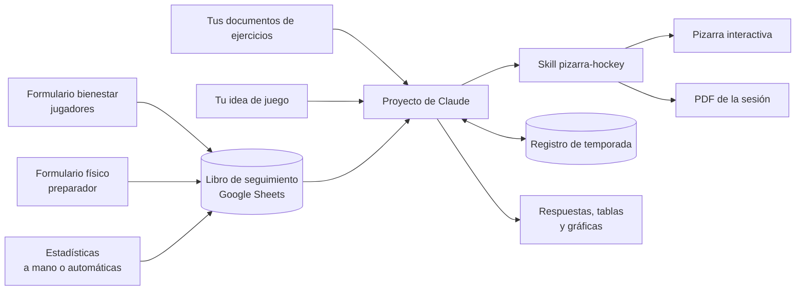

# 🏒 Hockey Coach Assistant

**Español** · [English](README.en.md)

**Versión 1.0 · octubre de 2026** · [Novedades](CHANGELOG.md)

> **Antes de empezar:** este kit funciona dentro de **Claude**, así que necesitas una cuenta de Claude. Puedes probarlo con el plan gratuito, pero para usarlo de verdad se recomienda **Claude Pro** (más detalles en [Requisitos](#requisitos)).
>
> **Es la primera versión.** Funciona y se usa a diario con un equipo real, pero seguirá mejorando: revisa los [Próximos pasos](#próximos-pasos) y el [registro de cambios](CHANGELOG.md).

**Un asistente de entrenador de hockey hielo construido sobre Claude.** Programa entrenamientos con tus propios ejercicios y según tu idea de juego, los dibuja en una pizarra interactiva, genera el PDF de cada sesión, lleva el registro de lo trabajado durante la temporada y hace seguimiento del bienestar, la condición física y las estadísticas de tus jugadores. Después le preguntas lo que quieras y te responde con datos, tablas o gráficas.

> *🇬🇧 Full English version: [README.en.md](README.en.md).*


## Qué hace

| Función | Cómo |
|---|---|
| **Programar entrenamientos** | Le pides una sesión («60 min, superioridad 2c1») y propone ejercicios sacados de tus documentos, citando la fuente y adaptados a tu idea de juego. |
| **Pizarra interactiva** | Cada ejercicio se dibuja en una pista IIHF con notación estándar. Puedes mover jugadores, dibujar líneas y descargar la imagen. |
| **PDF de la sesión** | Al confirmar una sesión, genera un PDF con portada, resumen de tiempos y una página por ejercicio con su diagrama. |
| **Registro de temporada** | Guarda cada sesión y muestra cuántos minutos has dedicado a cada contenido. |
| **Seguimiento de jugadores** | Formulario mensual de bienestar para los jugadores, formulario de pruebas físicas para el preparador y estadísticas de partidos. Todo en un libro de Google Sheets. |
| **Análisis** | Le preguntas en lenguaje normal y te responde con cifras, resúmenes, tablas o gráficas. Además te avisa de lo importante sin que se lo pidas. |

| PDF: portada | PDF: ejercicio | Registro de temporada |
|---|---|---|
|  |  |  |

*Todas las capturas usan datos inventados.*

## Cómo funciona



- **Proyecto de Claude:** el «cerebro». Contiene tus documentos y las instrucciones con tu idea de juego.
- **Skill `pizarra-hockey`:** Claude describe cada ejercicio en coordenadas reales de pista y un script lo dibuja siempre con el mismo estilo. El mismo dibujo sirve para la pizarra y para el PDF.
- **Registro de temporada:** una página publicada en Claude con su propia base de datos. Claude escribe en ella cada sesión confirmada y la lee para responder.
- **Seguimiento:** Google Forms y Google Sheets. Los jugadores y el preparador no necesitan cuenta de Claude ni acceso al libro.

## Requisitos

- **Una cuenta de Claude.** Los proyectos y las skills están disponibles también en el plan gratuito (con un máximo de 5 proyectos), así que puedes probar el kit sin pagar. Para usarlo de verdad se recomienda **Claude Pro**: la búsqueda en bibliotecas grandes de documentos (RAG) solo está en los planes de pago, y el plan gratuito tiene límites de uso diarios. *Datos de octubre de 2026: comprueba las condiciones actuales en support.claude.com.*
- **La ejecución de código activada** en Claude (Configuración → Capacidades), necesaria para la pizarra y el PDF.
- **Una cuenta de Google** para el seguimiento de jugadores, con el conector de Google Drive activado en Claude.
- Tus documentos de ejercicios (PDF con texto, Word, etc.).

## Instalación

Unas 2 horas en total, la mayor parte en el cuestionario de idea de juego. Cada bloque funciona por separado: puedes instalar solo los pasos 1–4 y añadir el resto más adelante.

### 1. Define tu idea de juego

Abre [`plantillas/cuestionario-idea-juego.md`](plantillas/cuestionario-idea-juego.md) y sigue la opción A: pégalo en un chat de Claude y deja que te entreviste. Al final tendrás el documento «Idea de juego». Tienes un ejemplo ficticio completo en [`plantillas/idea-de-juego-ejemplo.md`](plantillas/idea-de-juego-ejemplo.md).

### 2. Crea el proyecto

En Claude: **Proyectos → Nuevo proyecto**. Sube tus documentos de ejercicios al conocimiento del proyecto. Si son escaneos o imágenes, pásalos antes a texto: Claude encuentra mucho mejor los ejercicios escritos.

### 3. Pega las instrucciones

Abre [`plantillas/instrucciones-proyecto.md`](plantillas/instrucciones-proyecto.md), sustituye los huecos `{{...}}` (tu nombre, equipo y categoría), pega tu idea de juego donde se indica y copia todo en las **instrucciones del proyecto**. La idea de juego va en las instrucciones, no en el conocimiento: así se aplica entera en cada conversación.

### 4. Instala la skill de la pizarra

Sube [`skill/pizarra-hockey.skill`](skill/pizarra-hockey.skill) en la sección **Skills** de la configuración de Claude. El código fuente está en [`skill/pizarra-hockey/`](skill/pizarra-hockey/).

### 5. Publica el registro de temporada (opcional)

1. Cambia el nombre de tu equipo en la constante `EQUIPO` de [`registro/registro-temporada.html`](registro/registro-temporada.html).
2. En un chat de Claude, sube el archivo y pide: *«Publica este archivo como artifact con la capacidad de base de datos (db)»*.
3. Copia el enlace del artifact en el hueco `{{URL_REGISTRO}}` de las instrucciones.

### 6. Monta el seguimiento de jugadores (opcional)

1. Sube [`seguimiento/seguimiento-plantilla.xlsx`](seguimiento/seguimiento-plantilla.xlsx) a Google Drive y guárdalo como Hoja de cálculo de Google.
2. Rellena la pestaña **Jugadores** y borra las filas de ejemplo.
3. **Revisa las preguntas y las pruebas** en las pestañas «Preguntas bienestar» y «Pruebas físicas». Las que vienen son de ejemplo: cámbialas a tu gusto (ver [Personalización](#personalización)).
4. En el libro: **Extensiones → Apps Script**. Crea tres archivos con el botón «+» → *Apps Script*: `config`, `bienestar` y `fisico`, y pega el contenido de los archivos de [`seguimiento/`](seguimiento/). Cambia el nombre del equipo en `config.gs`.
5. Ejecuta `crearFormularioBienestar` y `crearFormularioFisico`. Google te pedirá permisos y avisará de que la app «no está verificada»: es tu propio script, así que pulsa *Configuración avanzada → Ir a…*.
6. Los enlaces de los formularios quedan en la pestaña «Cómo usar»: el de bienestar se manda al grupo de jugadores, y el físico al preparador. Opcional: `activarRecordatorioMensual` te envía un correo cada día 1 con el enlace y un mensaje listo para el grupo.
7. Copia el nombre y el ID del libro (la parte de la URL entre `/d/` y `/edit`) en los huecos `{{NOMBRE_LIBRO}}` y `{{ID_LIBRO}}` de las instrucciones.

### 7. Pruébalo

En un chat dentro del proyecto:

- *«Sesión de 60 minutos para trabajar el 2c1. 16 jugadores y 2 porteros.»*
- *«Me gusta, es para el martes 6. Dame el documento.»* → PDF y registro.
- *«¿Qué hemos trabajado menos este mes?»*

## Análisis: pregúntale lo que quieras

Una vez que hay datos (sesiones registradas, respuestas de bienestar, pruebas físicas y estadísticas), no hace falta montar informes ni tablas dinámicas. **Le preguntas en el chat del proyecto y el asistente lee los datos y te responde**: con cifras concretas, un resumen, una tabla o una gráfica, según lo que pidas.

**Ejemplos de preguntas:**

| Tema | Pregunta |
|---|---|
| Entrenamientos | *«¿Qué contenidos llevo más de dos semanas sin trabajar?»* · *«¿Cuántos minutos llevamos de transiciones esta temporada?»* |
| Bienestar | *«¿Cómo está el grupo este mes?»* · *«¿Quién no ha respondido el formulario?»* · *«Resúmeme los comentarios abiertos»* |
| Un jugador | *«Hazme un resumen de cómo va Nombre: bienestar, pruebas y estadísticas»* |
| Pruebas físicas | *«Hazme una gráfica de la evolución del sprint del equipo mes a mes»* · *«¿Quién ha empeorado en el salto?»* |
| Estadísticas | *«¿Quién lleva más puntos?»* · *«Gráfica de goles a favor y en contra por partido»* |
| Cruces | *«¿Los que dicen que se esfuerzan más mejoran más en las pruebas?»* · *«¿Ha bajado el disfrute en las semanas con más carga?»* |
| Informes | *«Prepárame un resumen de la primera vuelta para la reunión con el club»* |

**Lo que hace sin que se lo pidas:** cuando revisa los datos, te avisa de bajadas fuertes de bienestar, empeoramientos en las pruebas, jugadores que no han respondido y diferencias entre cómo se ve el jugador y lo que dicen los datos. Si un comentario abierto apunta a algo serio, te lo dice con claridad y te recomienda tratarlo con el club y la familia.

**Cómo interpreta los datos:** compara a cada jugador consigo mismo a lo largo del tiempo (no hace rankings salvo que se lo pidas), y usa las columnas «Más alto es» y «Mejor si» de las pestañas de preguntas y pruebas para saber si un valor alto es bueno o malo. Por eso funciona con cualquier pregunta o prueba que definas.

## Personalización

### Preguntas de bienestar

Se editan en la pestaña **«Preguntas bienestar»** del libro, sin tocar código. Una fila por pregunta:

| Columna | Qué poner |
|---|---|
| Pregunta | El texto que verá el jugador. |
| Tipo | `Escala 1-5`, `Escala 1-10`, `Opción múltiple`, `Casillas` (varias respuestas), `Respuesta corta` o `Párrafo`. |
| Opciones | Escalas: etiquetas del mínimo y del máximo separadas por `\|` (`Nada \| Mucho`). Opción múltiple y casillas: las opciones separadas por `\|`. |
| Obligatoria | `Sí` o `No`. |
| Más alto es | Solo escalas: `Mejor`, `Peor` o `Neutro`. Le dice al asistente cómo interpretarla (en «cansancio», más alto es peor). |

La pregunta «¿Quién eres?», con la lista de jugadores, se añade sola al principio.

### Pruebas físicas

Se editan en la pestaña **«Pruebas físicas»**. Una fila por prueba: nombre (con la unidad, por ejemplo `Sprint 15 m (s)`), unidad (`segundos`, `centímetros`, `repeticiones` u `otro`), si es mejor un valor menor o mayor, y el protocolo. El formulario solo aceptará números en esa unidad, y el protocolo aparecerá debajo de cada prueba para que se mida igual cada mes.

### Cambios después de crear los formularios

Edita el formulario con su enlace de edición (pestaña «Cómo usar») y actualiza también la pestaña correspondiente, para que el asistente siga interpretando bien los datos. Evita cambiar preguntas o pruebas a mitad de temporada: perderás la comparación mes a mes. Si entra o sale un jugador, actualiza la pestaña «Jugadores» y ejecuta `actualizarJugadores`.

### Estadísticas

- **A mano (por defecto):** pestaña «Estadísticas», una fila por jugador y partido. El jugador se elige en un desplegable y los puntos se calculan solos.
- **Automáticas (opcional):** si tu federación publica las estadísticas en una web pública, se pueden importar solas:
  - si las tablas están en el HTML de la página, con la función `IMPORTHTML` de Google Sheets, sin código;
  - si la página carga los datos con JavaScript (muy habitual en las plataformas de las federaciones), con un pequeño script de Apps Script programado para ejecutarse cada día.

  En los dos casos, pide ayuda a Claude con el enlace de tu página: te dirá cuál de los dos casos es y te escribirá la fórmula o el script.

### Otras

- **Contenidos del registro:** la lista de contenidos está en `TAX` y `BLOQUES` dentro de `registro-temporada.html` y en la sección «Registro de sesiones» de las instrucciones. Si cambias una, cambia la otra.
- **Normas que corrijas a menudo:** añádelas al final de las instrucciones en una sección «Reglas aprendidas». Pídele al asistente: *«Redáctame esto como regla para las instrucciones»*.
- **Enlaces perdidos:** si desaparecen los enlaces de los formularios de «Cómo usar», ejecuta `repararEnlaces`.

## Privacidad

El seguimiento trata **datos de menores**, y parte de ellos (bienestar, condición física) se acercan a datos de salud.

- Antes de recoger datos, habla con tu club: en España, para menores de 14 años hace falta el consentimiento de los padres.
- Comparte el libro de seguimiento solo con el cuerpo técnico. Los formularios permiten que jugadores y preparador aporten datos sin acceso al libro.
- Si en un formulario de bienestar un jugador cuenta algo serio, se gestiona con el club y la familia. El asistente está instruido para avisarte, no para diagnosticar.
- No publiques capturas con datos reales de jugadores.

## Limitaciones

- La colocación inicial de los jugadores en la pizarra a veces queda apretada. Se corrige arrastrando, y la versión editada se le puede devolver a Claude con «Ver JSON».
- El PDF necesita un navegador en el entorno de ejecución de código de Claude. Si no lo hay, el script deja un HTML imprimible.
- El registro de temporada depende de que Claude tenga la herramienta de artifacts con base de datos en tu cuenta.
- El reparto de minutos por contenido es aproximado: cada ejercicio se asigna a uno o dos contenidos principales. Sirve para ver tendencias, no como medida exacta.

## Próximos pasos

Esta es la **versión 1.0**. Mejoras previstas para próximas versiones (las sugerencias son bienvenidas en *Issues*):

- [ ] Script de importación automática de estadísticas para plataformas de federaciones
- [ ] Vista de jugadores en el registro de temporada
- [ ] Versión en inglés de las plantillas
- [ ] Interfaz web propia (usaría la API de Claude, que se paga aparte de la suscripción)

## Estructura

```
hockey-coach-assistant/
├── plantillas/
│   ├── cuestionario-idea-juego.md   ← empieza aquí
│   ├── instrucciones-proyecto.md
│   └── idea-de-juego-ejemplo.md     ← ejemplo ficticio
├── skill/
│   ├── pizarra-hockey.skill         ← para instalar en Claude
│   └── pizarra-hockey/              ← código fuente (SKILL.md, plantilla HTML, scripts)
├── registro/registro-temporada.html
├── seguimiento/
│   ├── seguimiento-plantilla.xlsx   ← preguntas y pruebas editables
│   ├── config.gs
│   ├── bienestar.gs
│   └── fisico.gs
├── docs/capturas/
└── CHANGELOG.md                     ← novedades de cada versión
```

## Licencia

MIT. Úsalo, adáptalo y compártelo. Si lo mejoras, ¡abre un *pull request*!

---

Creado por **Samuel Arraiza Recalde**, científico de datos y entrenador de hockey hielo en categorías de formación.
